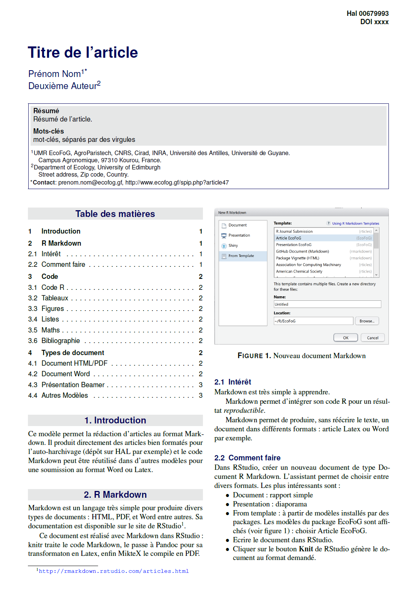

# Modèle d'article
Utilitaires pour l'UMR EcoFoG

Modèle d'article pour l'autoarchivage, en LaTeX.

Le modèle est identique à celui du package [EcoFoG](https://github.com/EcoFoG/EcoFoG) pour R, à utiliser avec R Markdown.

C'est une adaptation du modème Stylish Article de Mathias Legrand (legrand.mathias@gmail.com).
Il utilise le modèle bibliographique de Methods in Ecology and Evolution.